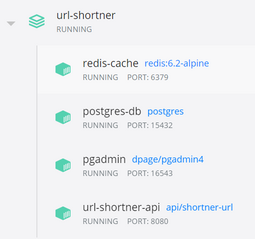

# URL Shortner API

## Project Details

This project aims to shorten URLs. The architecture created has the following 4 services:
- PostgreSQL DataBase: responsible for storing shortened URL keys;
- PgAdmin: responsible for providing a web interface to deal with the database, in case the user does not have a tool already installed;
- Redis Server: responsible for caching data;
- URL Shortener Api: responsible for the business rule, which involves receiving the url sent by the user and converting it.

## Stack

- Java 1.8
- PostgreSQL
- PgAdmin4
- Redis
- Maven
- Docker/Docker-Compose
- Lombok
- Spring Boot
- Spring Jpa
- Spring Test
- Spring Validation
- Spring Thymeleaf

## How to Configure:

To make testing easier, I decided to create a docker-based architecture, where all services communicate with each other. So it is not necessary to install the services manually on the user's machine, docker will provide everything for us.
First we need to ensure that we have docker installed on our machine.

Click [here](https://docs.docker.com/get-docker/) to go to Docker download tutorial.

With docker running we must go to the root folder of this project, where we will find the file docker-compose-yml.
Now we must execute the command below in some command-line interface:
```bash
docker-compose up -d
```

In the docker panel we must verify that all services are running.

{:height="36px" width="36px"}.




The next step is to access the address http://localhost:8080/ and start using the web application.

### PgAdmin Credentials

Access address: http://localhost:16543/login

```bash
Login: hugo.moraes@gmail.com
Password: PgAdmin2021!
```

### Postgre DataBase Credentials

Credentials to use whe we are creating connection using PgAdmin (Docker enviroment) :

```bash
Host: postgres-db
Port: 5432
Login: postgres
Password: PgAdmin2021!
```

Credentials to use when we are outside the docker environment, for example: accessing via DBeaver or any other client application :

```bash
Host: localhost
Port: 15432
Login: postgres
Password: PgAdmin2021!
```


